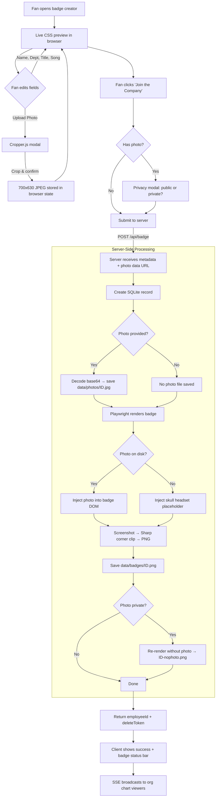
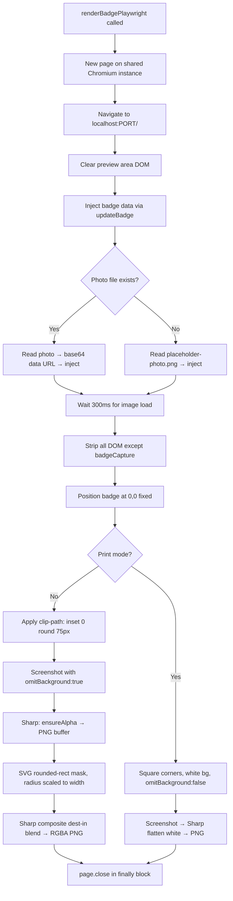
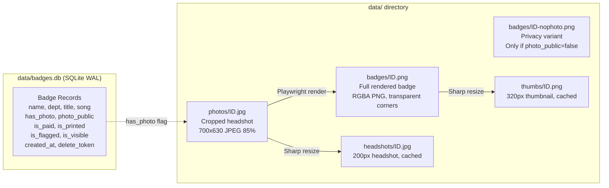

# Help Desk Badge Generator

Employee badge creator for [Help Desk](https://open.spotify.com/artist/64AtvxMQy2FsyDOX0zVfke), a comedy/office-themed punk band from Madison, WI. Fans create custom corporate ID badges at live shows, pick a department and job title, and join the company org chart.

Built for merch tables — runs on a tablet or laptop at shows, optionally behind a captive WiFi portal so fans just connect and start building.

## Features

**Badge Creator**
- Click-to-edit badge designer — click any element to customize via anchored popover
- Keyboard keycap header with binary texture overlay
- 11 departments, 17 job titles, 19 access levels, 13 captions
- Song waveform "barcodes" generated from real audio RMS data (14 songs)
- Photo upload with crop tool
- "sudo randomize" button for instant random badges
- PNG download
- Print-ready badge export (`GET /api/badge/:id/print` — 600 DPI CR80, white bg, square corners)

**Employee Directory**
- Division-grouped hierarchy with color-coded headers
- Responsive grid (5/4/3/2 columns), mobile responsive (CSS transform scaling, touch targets)
- Server-side thumbnails (sharp, 320px, cached on disk)
- Server-side badge rendering via Playwright (replaces client-side html2canvas for creation)
- Four view modes with keyboard shortcuts (1/2/3/4):
  - **Grid** [1] — default card layout with photo circles, animated odometer counter
  - **AI Review** [2] — 10x44 split-flap text grid with AI performance reviews (78 comedy reviews, 13 styles, 20 skills), progressive reveal animation, headshot tile panel with canvas color sampling
  - **Dendrogram Tree** [3] — D3 horizontal hierarchy with neon glow nodes, full-viewport layout
  - **Arcade Select** [4] — fighting game character select grid with RPG stats and VS screen

**Live Show Features**
- Presentation mode (`/presentation`) — band intro, auto-rotating views (grid → dendro → arcade, 90s each), chyron ticker
- SSE real-time badge events, stock ticker, terminal onboarding animation, spotlight mode
- CSS donut chart (department distribution), demo mode (5-100 test badges)

**Admin (HR Dashboard)**
- Bearer token auth with rate limiting (5 fails = 15min lockout), CSP headers, localhost-only option
- Search, filters, payment/print tracking, content flagging (two-tier profanity filter)
- Analytics dashboard, CSV export, band member photo management

## Tech Stack

- **Runtime:** [Bun](https://bun.sh)
- **Server:** [Hono](https://hono.dev)
- **Database:** SQLite (bun:sqlite, WAL mode)
- **Badge Rendering:** [Playwright](https://playwright.dev) (server-side, headless Chromium)
- **Thumbnails:** [sharp](https://sharp.pixelplumbing.com)
- **Visualizations:** [D3.js](https://d3js.org) (dendrogram tree view)
- **Client-side:** Vanilla JS, Cropper.js, html2canvas (PNG download fallback)
- **CI/CD:** GitHub Actions → ghcr.io → Docker (Unraid)

## Quick Start

```bash
# Clone and install
git clone https://github.com/diamondluke-1220/hd-badge.git
cd hd-badge
bun install

# Run (creates data/ dir and SQLite DB automatically)
bun run dev        # watch mode
bun run start      # production
```

Open `http://localhost:3000` — badge creator. `/orgchart` — employee directory. `/presentation` — projector mode for live shows.

### Admin Panel

Set `ADMIN_TOKEN` to enable the HR Dashboard at `/admin`:

```bash
ADMIN_TOKEN=your-secret-here bun run start
```

## Docker

```bash
docker build -t hd-badge .
docker run -p 3000:3000 \
  -e ADMIN_TOKEN=your-secret-here \
  -v ./data:/app/data \
  hd-badge
```

Pre-built image available:

```bash
docker pull ghcr.io/diamondluke-1220/hd-badge:latest
```

### Environment Variables

| Variable | Default | Description |
|----------|---------|-------------|
| `PORT` | `3000` | Server listen port |
| `ADMIN_TOKEN` | *(empty)* | Bearer token for admin access |
| `ADMIN_LOCAL_ONLY` | `1` | Restrict admin to localhost (`0` for Docker/tunnel) |
| `TRUST_PROXY` | *(unset)* | Trust `X-Forwarded-For` headers (`1` behind proxy) |
| `SHOW_MODE` | `0` | Relaxed rate limits for live shows |

## Project Structure

```
src/
  server.ts          # Hono server, middleware, SSE, Playwright render, route wiring
  routes/portal.ts   # Captive portal detection + clearance routes
  routes/public.ts   # Public API (badge CRUD, org chart, images)
  routes/admin.ts    # Admin API (management, demo, presentation, export)
  db.ts              # SQLite schema, queries, migrations, band member seeding
  demo.ts            # Demo mode (test badge generation, cleanup)
  logger.ts          # Ring buffer logger (200 entries, categories)
  presentation.ts    # Presentation mode state machine + endpoints
  profanity.ts       # Two-tier content filter
  rate-limit.ts      # IP-based rate limiting
public/
  index.html         # Badge creator
  admin.html         # HR Dashboard
  presentation.html  # Projector display for live shows
  table-tent.html    # Printable merch table card with QR codes
  js/app.js            # Badge editor, popover system, renderer switching, init
  js/live-viz.js       # Live visualizations: SSE, ticker, animations, stats panel
  js/badge-render.js   # Badge DOM rendering (departments, titles, waveforms, access levels)
  js/shared.js         # Shared constants, utilities, window.HD namespace
  js/badge-pool.js     # Badge data pool for view renderers
  js/view-grid.js      # Grid view (default, odometer counter)
  js/view-reviewboard.js # AI Review (split-flap text grid, headshot tiles)
  js/view-dendro.js    # D3 dendrogram tree view
  js/view-arcade.js    # Arcade fighting game select view (layout, rotation, cursor)
  js/arcade-cinematic.js # VS cinematic system (fights, specials, effects)
  js/presentation.js   # Presentation mode client
  js/presentation-shims.js # Shims for presentation route compatibility
  css/               # App styles, badge styles, view-specific styles
  lib/               # Vendored deps (d3, html2canvas, cropper, qrcode)
  fonts/             # Self-hosted web fonts (Barlow, Inter, JetBrains Mono, Orbitron, Press Start 2P)
data/                # Runtime data (gitignored)
  badges.db          # SQLite database
  photos/            # Uploaded fan photos
  thumbs/            # Server-generated thumbnails
  headshots/         # Server-generated headshots (200px)
  badges/            # Server-rendered badge PNGs
```

## Badge Creation Flow



## Render Pipeline

Badges are rendered server-side via a shared headless Chromium instance (one browser, new page per render). Both fan creation and admin re-render use the same `renderBadgePlaywright()` function.



## Storage Layout



## API Endpoints

| Endpoint | Method | Auth | Purpose |
|---|---|---|---|
| `/api/badge` | POST | Rate limited | Create badge → Playwright render |
| `/api/badge/:id/image` | GET | Public | Serve badge PNG (respects photo privacy) |
| `/api/badge/:id/thumb` | GET | Public | 320px thumbnail (auto-cached) |
| `/api/badge/:id/headshot` | GET | Public | 200px headshot (auto-cached, privacy-aware) |
| `/api/badge/:id/print` | GET | Public | 600 DPI CR80, white bg, square corners |
| `/api/badge/:id/photo` | GET | Admin | Serve original cropped photo |
| `/api/admin/badge/:id/render` | POST | Bearer | Re-render badge via Playwright |
| `/api/admin/badge/:id/photo` | POST | Bearer | Upload/replace photo |
| `/api/admin/demo/start` | POST | Bearer | Generate 5-100 test badges |
| `/api/admin/presentation/start` | POST | Bearer | Start presentation mode |
| `/api/badges/stream` | GET | Public | SSE live badge events |

## License

MIT
