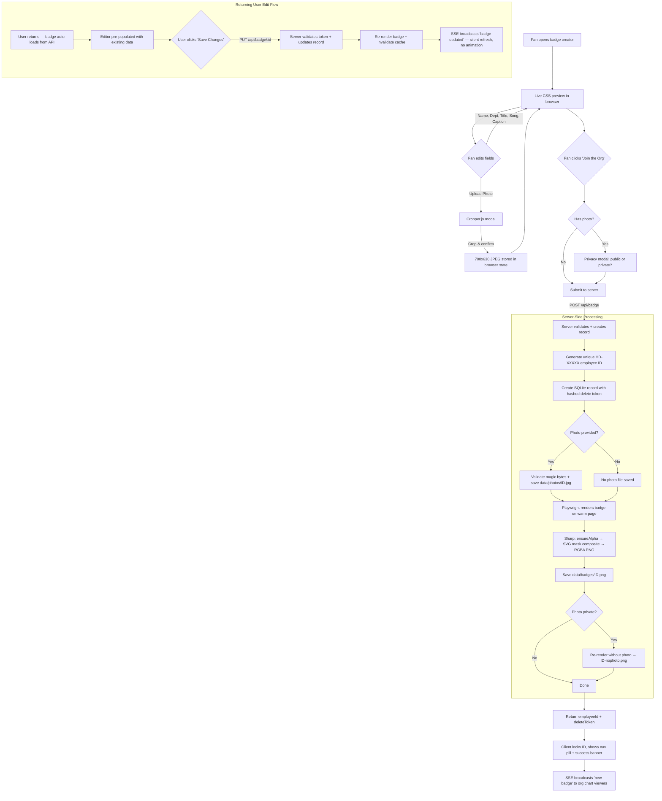
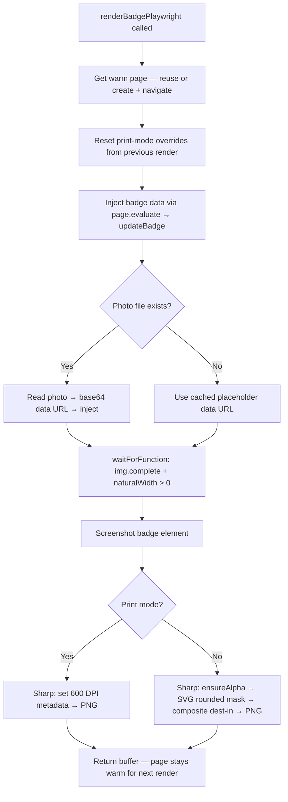
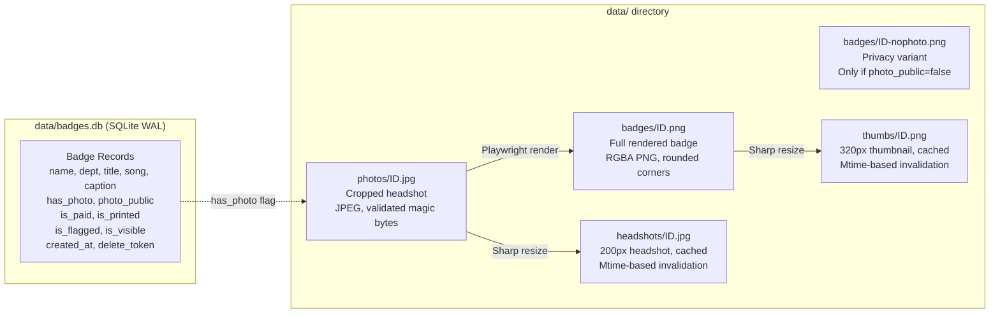

<p align="center">
  
</p>

# Help Desk Badge Generator

Employee badge creator for [Help Desk](https://open.spotify.com/artist/64AtvxMQy2FsyDOX0zVfke), a comedy/office-themed punk band from Madison, WI. Fans create custom corporate ID badges at live shows, pick a department and job title, and join the company org chart.

Built for merch tables — runs on a tablet or laptop at shows, optionally behind a captive WiFi portal so fans just connect and start building.

## Features

**Badge Creator**
- Click-to-edit badge designer — click any element to customize via anchored popover
- Keyboard keycap header with binary texture overlay
- 11 departments, 17 job titles, 19 access levels, 13 captions
- Song waveform "barcodes" generated from real audio RMS data (14 songs)
- Photo upload with crop tool, auto-shrink text for long names/titles
- "sudo randomize" button for instant random badges
- "Join the Org" submit button — server assigns unique employee ID (HD-XXXXX)
- Badge edit — returning users auto-load their badge, submit updates in place (same ID)
- Nav pill with employee ID, download arrow, and remove button
- Print-ready export (`GET /api/badge/:id/print` — 600 DPI CR80, white bg, square corners)

**Employee Directory**
- Division-grouped hierarchy with color-coded headers
- Responsive grid (5/4/3/2 columns), mobile responsive (CSS transform scaling, touch targets)
- Server-side thumbnails (sharp, 320px, cached on disk) + headshots (200px, cached)
- Server-side badge rendering via Playwright (warm page reuse for performance)
- Four view modes with keyboard shortcuts (1/2/3/4):
  - **Grid** [1] — default card layout with photo circles, animated odometer counter, auto-shrink text
  - **AI Review** [2] — 10x44 split-flap text grid with AI performance reviews (78 comedy reviews, 13 styles, 20 skills), progressive reveal animation, headshot tile panel with canvas color sampling
  - **Dendrogram Tree** [3] — D3 horizontal hierarchy with neon glow nodes, network-themed (router icon, ethernet cables, packet animations, CLI popups), full-viewport layout
  - **Arcade Select** [4] — fighting game character select with 36s VS cinematic, 3-act fight sequence, SNES boss portraits, ZzFX sound effects, combo counter, special moves

**Live Show Features**
- Presentation mode (`/presentation`) — band intro sequence, auto-rotating views (grid → dendro → arcade, 90s each), chyron ticker
- SSE real-time badge events with per-IP connection limiting
- Badge-updated events (silent refresh, no animation — prevents edit spam during shows)
- Terminal onboarding animation, spotlight mode, stock ticker
- CSS donut chart (department distribution), demo mode (5-100 test badges)

**Admin (HR Dashboard)**
- Bearer token auth with brute force protection (5 fails = 15min lockout), CSP headers, localhost-only option
- Search, filters (date/division/dept/photo/status), payment/print tracking, content flagging
- Two-tier profanity filter (hard-block hate speech, soft-flag edgy content)
- Photo upload with auto-render (badge re-rendered immediately after upload)
- Badge recovery — admin reissues token, generates recovery link for fans who lost localStorage
- Analytics dashboard, CSV export (formula injection protected), system logs
- Toast notifications (no alert() dialogs), row click-to-highlight, toggle action feedback
- Demo mode + presentation mode controls

**Design System**
- CSS custom properties (15 design tokens) for colors, surfaces, borders, radii
- 4-tier text hierarchy optimized for dark backgrounds (warm, high-contrast)
- External stylesheets for all views (admin CSS extracted from inline)
- Responsive: horizontal-scroll nav/stats on mobile, bottom-sheet popovers
- Corporate boot sequence on first visit (2.5s terminal animation, skip-able)
- Themed 404 "Incident Report" page with rotating sarcastic quips
- Real-time headcount badge in nav (SSE-powered, pulses green on new badges)

## Tech Stack

- **Runtime:** [Bun](https://bun.sh)
- **Server:** [Hono](https://hono.dev)
- **Database:** SQLite (bun:sqlite, WAL mode, 5 migrations)
- **Badge Rendering:** [Playwright](https://playwright.dev) (server-side, warm page reuse)
- **Image Processing:** [sharp](https://sharp.pixelplumbing.com) (thumbnails, headshots, corner rounding)
- **Visualizations:** [D3.js](https://d3js.org) (dendrogram tree view)
- **Client-side:** Vanilla JS, Cropper.js
- **CI/CD:** GitHub Actions → ghcr.io → Docker (Unraid)

## Quick Start

```bash
# Clone and install
git clone https://github.com/diamondluke-1220/hd-badge.git
cd hd-badge
bun install

# Run (creates data/ dir and SQLite DB automatically)
bun run dev        # watch mode
bun run start      # production
```

Open `http://localhost:3000` — badge creator. `/orgchart` — employee directory. `/presentation` — projector mode for live shows.

### Admin Panel

Set `ADMIN_TOKEN` to enable the HR Dashboard at `/admin`:

```bash
ADMIN_TOKEN=your-secret-here bun run start
```

## Docker

```bash
docker build -t hd-badge .
docker run -p 3000:3000 \
  -e ADMIN_TOKEN=your-secret-here \
  -v ./data:/app/data \
  hd-badge
```

Pre-built image available:

```bash
docker pull ghcr.io/diamondluke-1220/hd-badge:latest
```

### Environment Variables

| Variable | Default | Description |
|----------|---------|-------------|
| `PORT` | `3000` | Server listen port |
| `ADMIN_TOKEN` | *(empty)* | Bearer token for admin access |
| `ADMIN_LOCAL_ONLY` | `1` | Restrict admin to localhost (`0` for Docker/tunnel) |
| `TRUST_PROXY` | *(unset)* | Trust `X-Forwarded-For` headers (`1` behind proxy) |
| `SHOW_MODE` | `0` | Relaxed rate limits for live shows |

## Project Structure

```
src/
  server.ts          # Hono server, middleware, SSE, Playwright render, route wiring
  routes/portal.ts   # Captive portal detection + clearance routes
  routes/public.ts   # Public API (badge CRUD, edit, org chart, images)
  routes/admin.ts    # Admin API (management, demo, presentation, export)
  db.ts              # SQLite schema, queries, migrations (v1-v5), band member seeding
  demo.ts            # Demo mode (test badge generation, cleanup)
  logger.ts          # Ring buffer logger (200 entries, categories)
  presentation.ts    # Presentation mode state machine + endpoints
  profanity.ts       # Two-tier content filter
  rate-limit.ts      # IP-based rate limiting with LRU eviction
public/
  index.html         # Badge creator
  admin.html         # HR Dashboard
  presentation.html  # Projector display for live shows
  table-tent.html    # Printable merch table card with QR codes
  404.html           # Themed "Incident Report" error page
  recover.html       # Badge recovery page (token-based)
  js/app.js            # Badge editor, popover system, renderer switching, submit/edit flow
  js/boot-sequence.js  # First-visit corporate boot animation (localStorage gated)
  js/live-viz.js       # Live visualizations: SSE, ticker, animations, stats panel, headcount
  js/badge-render.js   # Badge DOM rendering (departments, titles, waveforms, access levels)
  js/shared.js         # Shared constants, utilities, window.HD namespace
  js/badge-pool.js     # Badge data pool for view renderers
  js/view-grid.js      # Grid view (default, odometer counter, auto-shrink text)
  js/view-reviewboard.js # AI Review (split-flap text grid, headshot tiles)
  js/view-dendro.js    # D3 dendrogram tree view (packet animations, CLI popups)
  js/view-arcade.js    # Arcade fighting game select view (layout, rotation, cursor)
  js/arcade-cinematic.js # VS cinematic system (fights, specials, effects)
  js/arcade-sound.js   # ZzFX procedural sound effects
  js/presentation.js   # Presentation mode client
  js/presentation-shims.js # Shims for presentation route compatibility
  css/app.css          # App UI styles + design tokens (:root custom properties)
  css/admin.css        # Admin dashboard styles (extracted from inline)
  css/badge.css        # Badge card styles (print-spec locked — DO NOT EDIT)
  css/arcade.css       # Arcade fighting game view styles
  css/presentation.css # Presentation mode display styles
  css/dendro.css       # Dendrogram network tree styles
  css/reviewboard.css  # Split-flap review board styles
  css/flap-base.css    # Shared Vestaboard tile base styles
  lib/               # Vendored deps (d3, html2canvas, cropper, qrcode, zzfx)
  fonts/             # Self-hosted web fonts (Barlow, Inter, JetBrains Mono, Orbitron, Press Start 2P, Roboto Condensed)
data/                # Runtime data (gitignored)
  badges.db          # SQLite database
  photos/            # Uploaded fan photos
  thumbs/            # Server-generated thumbnails
  headshots/         # Server-generated headshots (200px)
  badges/            # Server-rendered badge PNGs
```

## Badge Creation Flow



## Render Pipeline

Badges are rendered server-side via a warm Playwright page (single browser, reusable page). Both fan creation, admin re-render, and photo upload use the same `renderBadgePlaywright()` function.



## Storage Layout



## API Endpoints

| Endpoint | Method | Auth | Purpose |
|---|---|---|---|
| `/api/badge` | POST | Rate limited | Create badge → Playwright render |
| `/api/badge/:id` | GET | Public | Badge metadata (name, dept, title, caption, etc.) |
| `/api/badge/:id` | PUT | Delete token | Edit badge → re-render + quiet SSE update |
| `/api/badge/:id` | DELETE | Delete token | Self-service badge removal + file cleanup |
| `/api/badge/:id/image` | GET | Public | Serve badge PNG (respects photo privacy) |
| `/api/badge/:id/thumb` | GET | Public | 320px thumbnail (lazy-generated, cached) |
| `/api/badge/:id/headshot` | GET | Public | 200px headshot (lazy-generated, privacy-aware) |
| `/api/badge/:id/print` | GET | Public | 600 DPI CR80, white bg, square corners |
| `/api/orgchart` | GET | Public | Paginated badge list (division/dept filters) |
| `/api/orgchart/stats` | GET | Public | Department counts, newest hire, sparkline |
| `/api/badges/stream` | GET | Public | SSE live events (new-badge, badge-updated) |
| `/api/admin/badge/:id/render` | POST | Bearer | Re-render badge via Playwright |
| `/api/admin/badge/:id/photo` | POST | Bearer | Upload photo → auto re-render |
| `/api/admin/badge/:id/photo-source` | GET | Bearer | Serve original uploaded photo |
| `/api/admin/badges` | GET | Bearer | Admin badge list with filters |
| `/api/admin/demo/start` | POST | Bearer | Generate 5-100 test badges |
| `/api/admin/demo/cleanup` | POST | Bearer | Remove all demo badges + files |
| `/api/admin/presentation/start` | POST | Bearer | Start presentation mode |
| `/api/admin/badge/:id/recover` | POST | Bearer | Reissue delete token for badge recovery |
| `/api/admin/export/csv` | GET | Bearer | CSV export (formula injection protected) |

## Security

- Timing-safe admin token comparison (crypto.timingSafeEqual)
- Brute force protection (5 fails = 15min lockout, cleared on success)
- Photo upload magic byte validation (JPEG/PNG only) + max dimension check
- Per-IP SSE connection limiting (10 max)
- Rate limiting with LRU eviction (3/hour, 10/day; relaxed in SHOW_MODE)
- Two-tier profanity filter across all text fields including caption and accessCss
- CSP headers (frame-ancestors 'none', nosniff, DENY)
- CSV export formula injection prevention
- Startup orphan file sweep (cleans files with no matching DB record)
- Soft-delete file cleanup (user deletion removes all associated files)

## License

MIT
