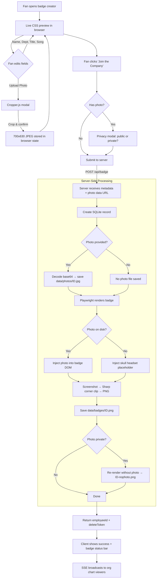
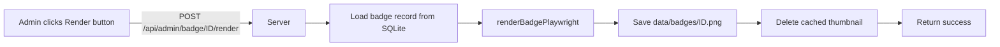
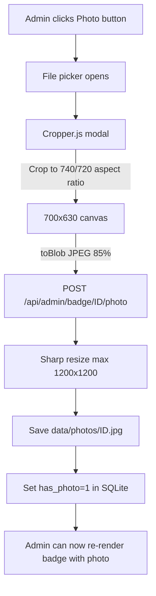
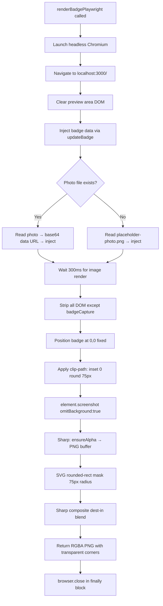
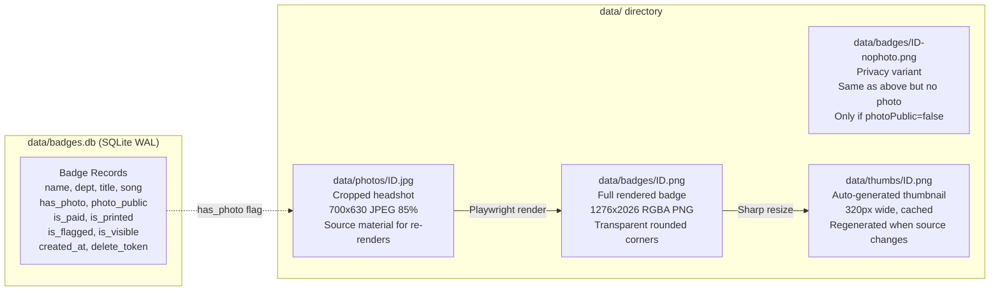

# Badge Render Architecture

> How badges get created, rendered, and stored in the Help Desk Badge Generator.
> Updated: 2026-03-12 | Commit: `6f50004`

---

## Fan Badge Creation Flow

---

## Admin Re-Render Flow

Both flows use the same `renderBadgePlaywright()` function — identical output regardless of who triggers the render.

---

## Admin Photo Upload Flow

---

## Playwright Render Pipeline

---

## Storage Layout

---

## API Endpoints (Render-Related)

| Endpoint | Method | Auth | Purpose |
|---|---|---|---|
| `/api/badge` | POST | Rate limited | Create badge → server renders via Playwright |
| `/api/badge/:id/image` | GET | Public | Serve full badge PNG |
| `/api/badge/:id/thumb` | GET | Public | Serve 320px thumbnail (auto-cached) |
| `/api/badge/:id/photo` | GET | Public | Serve cropped headshot JPEG |
| `/api/admin/badge/:id/render` | POST | Bearer token | Re-render badge via Playwright |
| `/api/admin/badge/:id/photo` | POST | Bearer token | Upload/replace photo (with crop modal) |

---

## Key Design Decisions

**Why server-side render for fan badges?**
- html2canvas output varies by browser/device — a fan on old Android gets different quality than desktop Chrome
- Playwright renders with perfect CSS fidelity every time
- Server controls the output — consistent print-ready badges
- Client still shows live CSS preview (zero render cost for browsing)

**Why keep photos separate from rendered badges?**
- Re-renders: if badge design changes, all existing badges can be re-rendered from stored photos
- Photo endpoint: org chart views could use cropped photos directly for better avatar quality
- Privacy: no-photo variant rendered separately without touching the original photo

**Why skull headset placeholder?**
- Badges without photos looked broken ("404 Photo Not Found" text)
- Placeholder gives consistent visual appearance across all badges
- On-brand (Help Desk skeleton mascot with headset polo)

**Photo homogenization:**
- Cropper.js enforces 740/720 aspect ratio on all uploads
- `getCroppedCanvas()` outputs fixed 700x630px regardless of source camera
- All photos are uniform — no device-specific variation
